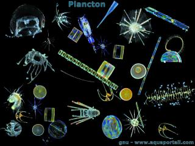

```{r setup, include=FALSE}
knitr::opts_chunk$set(echo = FALSE)
```

**Plancton**



## Vocabulary 

| Words from the text | Synonym/explanation in English |
| ------------------- | ------------------------------ |
| to go up| To increase |
| to settle | to live |
| tiny | very small |
| to thrive | to grow heathily |
| to suck up | ingest |
| a  dozen | 12 |
| a carbon-storing | a  stockage of carbon |
| unforessen |  unexpected |
| a dust |a particle |
| swept  |  blow |
| Framework | construction |
| Disturbance |  disorder |


## Analysis table 

|                              |                                                                     |
| ---------------------------- | ------------------------------------------------------------------- |
| Researchers                  | Chelsea Harvey, she is an environmental journalist who covering in climat's search                       |
| Published in?                | July 15, 2019                                                       |
| General topic?               |  The effects of iron particles on the development of phytoplankton                      |
| Procedure/what was examinated? | Nowadays, a lot of micro particles of iron are in the ocean. The phytoplankton is on the lowest level of the food chain. So if there is no phytoplankton there is no marine life. Scientists think that  iron fertilization is good for less iron zone. They think that is good for the development of the phytoplankton.So they tried a dozen of experiments on a little population of phytoplankton. But if there is a lot of phytoplankton,it can induce a development of toxic algae and some fish might eat it and die.So it can have a bad influence on the marin ecosystem.The iron particles which humans product are different of the iron particles from sand, they dissolve more easily. Some scientists tried to dump iron particles to raise up the salmon population but the problem is still the same. Now the pollution is still a problem and iron is still  released in the ocean and we don't know the true effects. |
| Conclusions/discovery?       | They found that the fertilization of plankton is more effective in iron-limited water. They discovered that the plankton can absorb the CO2 but they estimed that the plankton can absorb 1 gigaton per year and the emission from humans is 11 gigaton per year. The question is still open. We know that the iron fertilization can help improve pollution problems but it can have a lot of consequences on marine life.        |
| Remaining questions?         | We know that is a solution but it can do worse than better. We don't know what are the right effects on marine life.  |


<https://www.scientificamerican.com/article/humans-may-be-accidentally-geoengineering-the-oceans/?fbclid=IwAR14BsznwQWr_4mDy0KwkaLF1h3d2pAfStIF1D8lU5v99Y0dYryW_I3ktN0>

<http://localhost:8719/files/shared/projects/mussoi-lisa-blog/_posts/2019-09-18-article-1/article%201%20anglais.pdf>


