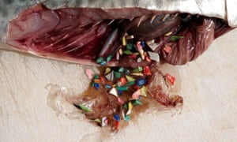

```{r setup, include=FALSE}
knitr::opts_chunk$set(echo = FALSE)
```

 

## Vocabulary

| Words from the text | Synonym/explanation in English |
| ------------------- | ------------------------------ |
| field-based | carried out in nature |
| surface slicks | the water at the surface  | 
| targeted | aiming at for a attack |
| swordfish  | large fish with long jaw  |
| Toxin-laden  | with a lot of toxin |
| gut  | belly |
| scaling up |  elargement|


## Analysis table 

|                              |                                                                     |
| ---------------------------- | ------------------------------------------------------------------- |
| Researchers                  |  Dr. Jonathan Whitney, it's a marin ecologist form the Joint Institute for Marine and Atmospheric Research and NOAA.|
| Published in?                |  11 November 2019                                                     |
| General topic?               |  the contamination of plastic in the larval fish                      |
| Procedure/what was examinated? | Near Hawaii, some scientists observe that there are more fish larvae on the surface of the water table. That was very good because lavaliere fish develop with phytoplacton and that's very good for the marine ecosystem.  Plastic is harmful to larval fish, but for adult fish, it can cause stomach upset and kill them.|
| Conclusions/discovery?       | Surface slicks are where the fish larvae find a lot of food, but it is also where there is a lot of plastic, so they eat a lot of tiny plastic particles. Scientists have found that many species of fish are affected by this problem.  Plastic is harmful to larval fish, but it can cause stomach upset and kill them in adult fish.|
| Remaining questions?         | Today the scientific doesn't kown all the effect of the plastic on fishes.  |


<https://phys.org/news/2019-11-prey-size-plastics-invading-larval-fish.html>

<https://mussoi-lisa.github.io/mussoi-lisa-blog/posts/2019-11-30-article-4/>


