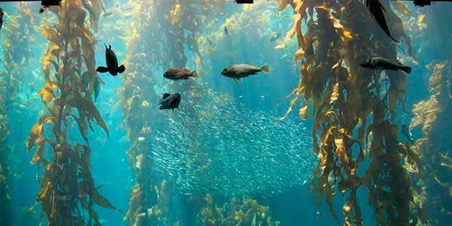

```{r setup, include=FALSE}
knitr::opts_chunk$set(echo = FALSE)
```


 


## Vocabulary

| Words from the text | Synonym/explanation in English |
| ------------------- | ------------------------------ |
| Kelp | Type of algae |
| Upwelling | Mouvement of hot water  | 
| Last-ditch | The final|


## Analysis table 

|                              |                                                                     |
| ---------------------------- | ------------------------------------------------------------------- |
| Researchers                  |  Jordan Hollarsmith from the UC Davis Bodega Marine Laboratory.|
| Published in?                |   13 November 2019                                                     |
| General topic?               |  The resistance of the kelp to the climate's change.                       |
| Procedure/what was examinated? | In 2014, a the temperature rise in California. There are kelp in Northern California and the same species in Southern California. The kelp oh the South died during the kelp of the North survived. So the scientific research if the kelp can survive at the climate's change like acidification of ocean or the rise of the temperature. So they test the developpement of the kelp in different water. They focus their survey on the giant kelp when there are at a early stage of their developpement because it's at that stage that there are the more sensible at environement changing. The researcher test different pH of water on the kelp to simular the acidification of the ocean and the upwelling. |
| Conclusions/discovery?       | They found that the high altitude kill the varech and the temperature kill the kelp of the Nothern california and prevent their reproduction. And they found that pH didn't hurt the reproduction of the kelp and it doesn't kill them.   |
| Remaining questions?         | |

<https://www.sciencedaily.com/releases/2019/11/191113170310.htm>

<https://mussoi-lisa.github.io/mussoi-lisa-blog/posts/2019-13-12-article-5/>

