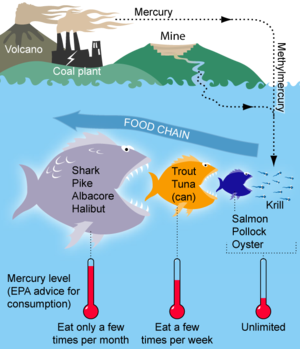

```{r setup, include=FALSE}
knitr::opts_chunk$set(echo = FALSE)
```





## Vocabulary 

| Words from the text | Synonym/explanation in English |
| ------------------- | ------------------------------ |
| To reshape| Shape differently  |
|  To rely | To depend on  |
| coal-fired | fuel by coal |
| exacerbate | worsen |
| Squid | Animal with tentacles, octopus |
| Endangered | Close to extinction|
| Anchovy | A species of small fish |
| cod |  Species of fish |
| Dwindling |Diminushing |

## Analysis table 

|                              |                                                                     |
| ---------------------------- | ------------------------------------------------------------------- |
| Researchers                  |  Not mentioned     |
| Published in?                |  November 8, 2019  |
| General topic?               | The climate change, the mercury rise up and the overfishing boost the toxic mercury in fish and other animals in the ocean. |
| Procedure/what was examinated? | The scientist saw that the toxic mercury level in the fish rise. It’s more important in big fish like salmon but there are high in food web. So they eat little fish like anchovy who have some toxic mercury in their muscle so there are an accumulation of toxic mercury in big fish.|
| Conclusions/discovery?       | The toxic mercury is the methylmecury it’s pregnant for the children. For the salmon it’s critic because there are exacerbate. Cause of pollution the temperature still to increase and it’s continue to increase the methylmercury in fish|
| Remaining questions?         | If we do nothing the situation will be worse and it will become very dangerous for human too.  |

<https://phys.org/news/2019-11-climate-overfishing-boosting-toxic-mercury.html>

<https://mussoi-lisa.github.io/mussoi-lisa-blog/posts/2019-18-11-article-3/>

