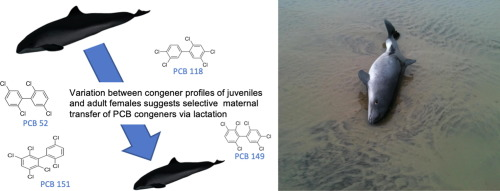

```{r setup, include=FALSE}
knitr::opts_chunk$set(echo = FALSE)
```





## Vocabulary 

| Words from the text | Synonym/explanation in English |
| ------------------- | ------------------------------ |
| Porpoise | Type of ceatacean |
| Run-off | Flow from|
| Dreging | Digging up of riverbed |
| Odontocetes | Familly of whales with theet |
| Understanding | Kwonledge |
| Orcas | Another type of cetacean, more precisely from the familly of odontocetes |
| Liguing | That lingers |
| Pathway | Little way  |
| PCB | Subtances toxic who are synthesize by industries |


## Analysis table 

|                              |                                                                     |
| ---------------------------- | ------------------------------------------------------------------- |
| Researchers                  |Rosie Williams, she's a researcher at the Institute of Zoology and Brunel University London. Susan Jobling is a co-author at  Brunel University London's|
| Published in?                |  Decembre 2, 2019|
| General topic?               | PCB's are toxic subtance which is synthesize by industries, it used to make the paint black. Nowadays it's forbidden in Europe but it still to influence the marin's life like porpoise. The female porpoise are infected by PCB then it suckle its calves and the calves are infected by PCB too. But PCB make big dommages at the brain of the porpoise calves.  |
| Procedure/what was examinated? | PCBs is toxic substances that are synthesized by industries and used to make paint black. Today it is banned in Europe, but it continues to affect marine life such as porpoises. Female porpoises are infected with PCBs, then they nurse their young and the young are also infected with PCBs. But PCBs cause severe brain damage in young porpoises. |
| Conclusions/discovery?       | Scientists first discovered that there are 209 types of PCBs and that all these types form a neurotoxic cocktail. They discovered that PCBs are dangerous for the brain development of baby porpoise. PCBs are present in the milk of whales and they pass it on to the calves, but not to the calves as well. If an animal contains PCBs, its predator will eat it and get PCBs. So the top predator in the food chain will have lots of PCBs. They have tried to control PCBs but it is impossible because there are many mixtures of PCBs and each PCB is different.  |
| Remaining questions?         | They don't know all effects of the PCB on the marin's life neither how stop this.   |

<https://phys.org/news/2019-12-harbor-porpoise-calves-exposed-neurotoxic.html>

<https://mussoi-lisa.github.io/mussoi-lisa-blog/posts/2020-02-12-article%206/>

