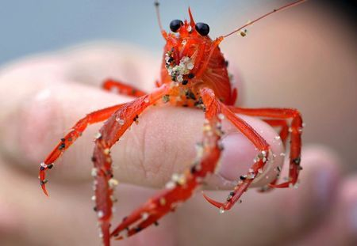

## Vocabulary 

| Words from the text | Synonym/explanation in English |
| ------------------- | ------------------------------ |
| shelter | refuge |
| cue | signal |
| sink   | fall |
| eutrophication | It's an accumulation of nutriment in water |
| seawage |  liquid waste|
| up walling  |  it's when water return to surface|
| deplete | use up |

## Analysis table 

|                              |                                                                     |
| ---------------------------- | ------------------------------------------------------------------- |
| Researchers                  |Lillian McCormick is scientists at Scripps Institution of Oceanography at the University of California San Diego, Nicholas Oesch is a researcher at the UC San Diego Department of Psychology.|
| Published in?                |  9 may 2019|
| General topic?               | Low oxygen levels could temporarily blind a marine animal such as a crab or squid. Especially if the animals are in the larval stage. When an animal is in the larval stage, it is in the zooplankton. Zooplankton need to see their prey, hide or migrate. But because of pollution, oxygen levels drop and animals can go blind. |
| Procedure/what was examinated? | They exposed animals such as crabs or squid to different levels of oxygen and examined the visual response obtained with an electrode that was connected to the animals retina.  |
| Conclusions/discovery?       | They found that mink can be reduced by 60-100% due to the low oxygen content. Vision began to decrease at the level of oxygen found at the surface of the ocean. The ocotopus lasted longer than the other animals. But when the oxygen level increases, they regains their sight. |
| Remaining questions?         |They don't how it infect the behaviour of animals because they need their vision to the migration or to eat and see their prey.     |

<https://phys.org/news/2019-05-oxygen-temporarily-marine-invertebrates.html> 

<https://mussoi-lisa.github.io/mussoi-lisa-blog/posts/2020-02-24-article-7/>

