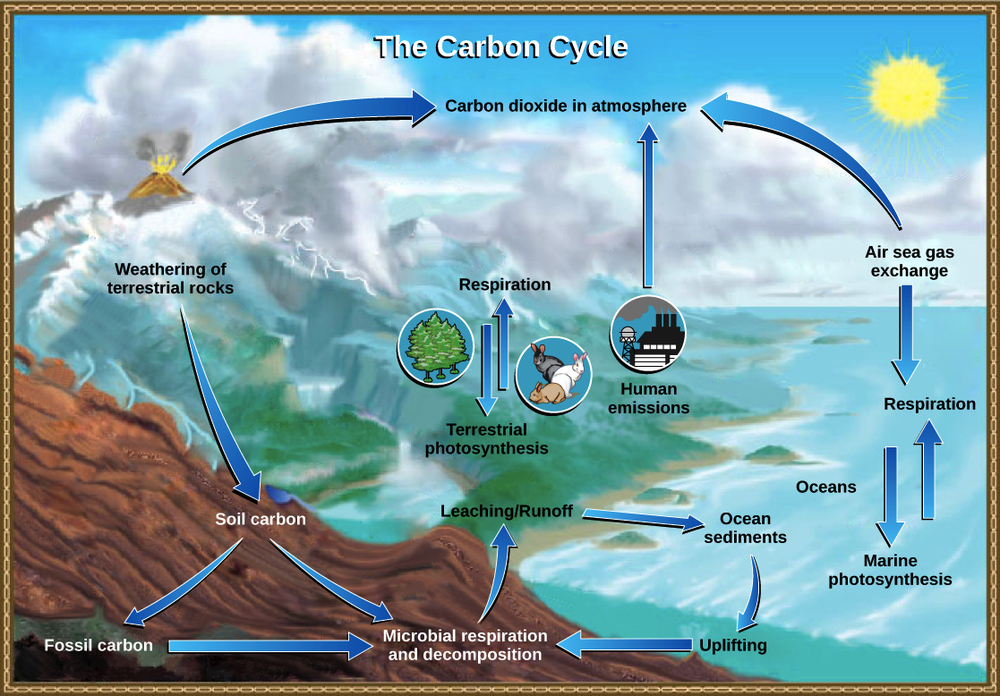

Nowadays, peoples used to talk about the increase of the global warming, the hole in the ozone-layer, acidification of the ocean, the increase of CO2 in atmosphere  or all the plastic that can’t dissolve on the ground or in the ocean. All this consequences of the human activities have badly effects on the earth, for exemple the pollution of the soil can inhibit the plant life and inhibit the alimentation of the population and the animals. This is one of the reasons many species are extinct or it can make food poisonous. But it have badly effects on oceans and marine’s life too…

Firstly, there are excess of CO2 in atmosphere, it’s essentially cause by the industries and the car. The carbon is everywhere, it’s in atmosphere, in the rocks, in ocean, in plants,  in human, in soil and in fossils fuel. Most of it is in the rock and the rest circulate between the compartments, the circulation is call « Cycle of Carbon ». There the slow Carbon cycle and the fast Carbon cycle, the slow Carbon Cycle began with the rain which degrades the rocks and take with her Calcium ion. It will go in ocean and react with Bicarbonate ion (HCO3-) and it will make the shell of some marine organisme. The slow circule puts Carbon in the atmosphere through the volcanoes but this regulation between ocean, rock, volcanoes and atmosphere take more than one hundred years so it isn’t the cause of the excess of CO2 in atmosphere. The fast Carbon Cycle is the Carbon which are exchange between the organisme plants absorbs it in atmosphere, and animals release it. But cause of industries and the combustion of the fossil fuel this cycle are perturbed it must keep its balance so if there are more CO2 in atmosphere the excess will go in ocean or in the other compartments. This excess of CO2 will react with water and ions of CO3^2- that come from the shell of marine’s animals and corals. This reaction product ions of hydrogen, that ions decrease the pH and acidifie the oceans. 

				CO2 + H2O + CO3^-2 -> 2HCO3-

An another big problem in ocean is the accumulation of plastics. Plastics are used for packaging, bottles or for the construction but every years it’s more than 8 million tons of plastic that are released in ocean. Plastics are dangerous for all the marin’s life because it can choke, poisoned or intoxicate marins animals. Frequently, the animals see a piece of plastic and think that it’s a prey so it eat that and can die.
